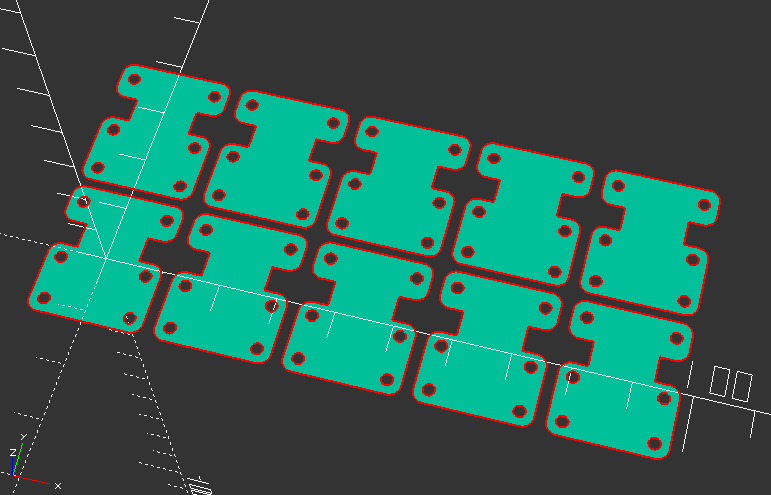

Electroluminescent Panel Strain Relief
===

A common failure of 'wearable' EL panels is to have the connection between
the wires and the panel fray and disconnect.
The strain relief piece is meant to help relieve the strain on the wire
by giving extra support.

LICENSE
---

All files in this directory are licensed under [CC0](https://creativecommons.org/share-your-work/public-domain/cc0/)

