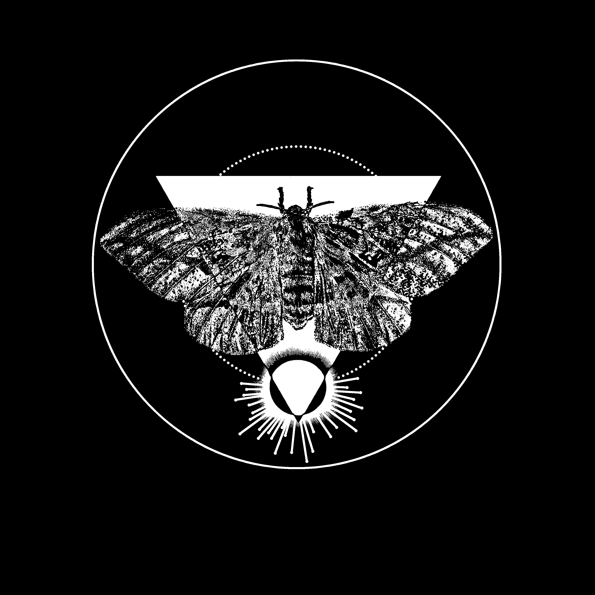

Lunar Eclipse Moth
===

This patch is based on the 
image of a *Dryocampa imperialis* from the 1891 book
['Among the moths and butterflies: a revised and enlarged edition of "insect lives ; or, Born in prison"'](https://archive.org/details/amongmothsbutter00balluoft/page/122) by Julia P. Ballard (Julia Perkins).

The basis for the lunar eclipse was taken from the 1881 book
["Les merveilles celestes, lectures du soir"](https://archive.org/details/lesmerveillesc00flam/page/328) by Camille Flammarion.

License
---

Creative Commons Zero ([CC0](https://creativecommons.org/share-your-work/public-domain/cc0/))

Please use this design, art and all source files in this directory as you wish.
Credit is appreciated but not necessary.
