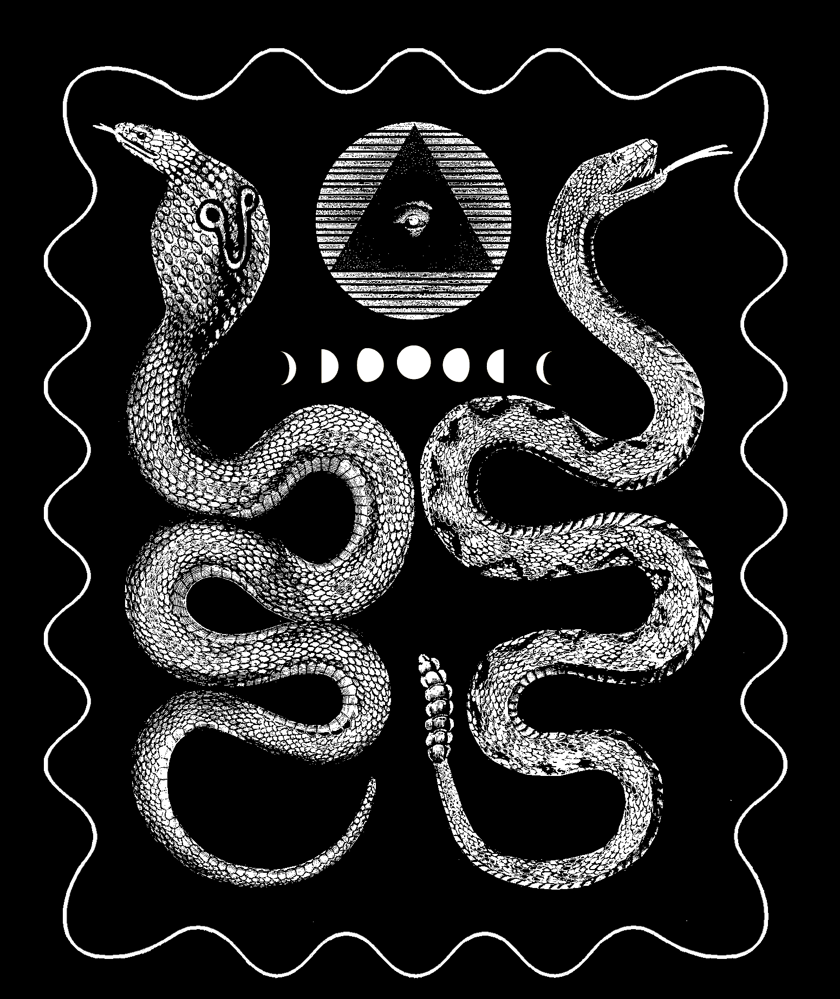

Snake Pair
===

"Snake Pair" patch.

Credits
---

* [Snakes](https://www.biodiversitylibrary.org/item/133381#page/72/mode/1up))
* [Moon Phases](https://commons.wikimedia.org/wiki/File:Moon_Phases.svg)
* [Eye](https://archive.org/details/regvlaemblematic01bene/page/n83))

License
---

All files in this directory, unless explicitely stated otherwise,
are under a [CC0](https://creativecommons.org/share-your-work/public-domain/cc0/) license.

