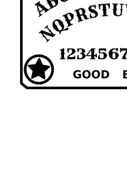

Custom Ouija Board
===

An Ouija board that is completely in the public domain (CC0).

Artwork taken from [Legendes Bretonnes by Mourice de Becque](https://archive.org/details/legendesbret00becq/page/n38/mode/2up).

Font is [Rye](https://fonts.google.com/specimen/Rye#license).

---

| |
|---|
|  |

A simple design for an Ouija board.

Font is a slightly modified [Rye](https://fonts.google.com/specimen/Rye#license).

---

| |
|---|
|  |

A simple design for an Ouija board.

Font is a slightly modified [Rye](https://fonts.google.com/specimen/Rye#license).

Eye by Mike Rowe from the Noun Project [noun project](https://thenounproject.com/term/eye/19791/).

License
---

Unless explicitly indicated otherwise,
all files in this directory are licensed under a [CC0](https://creativecommons.org/share-your-work/public-domain/cc0/) license.

